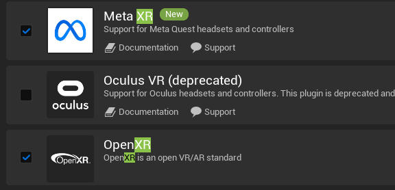
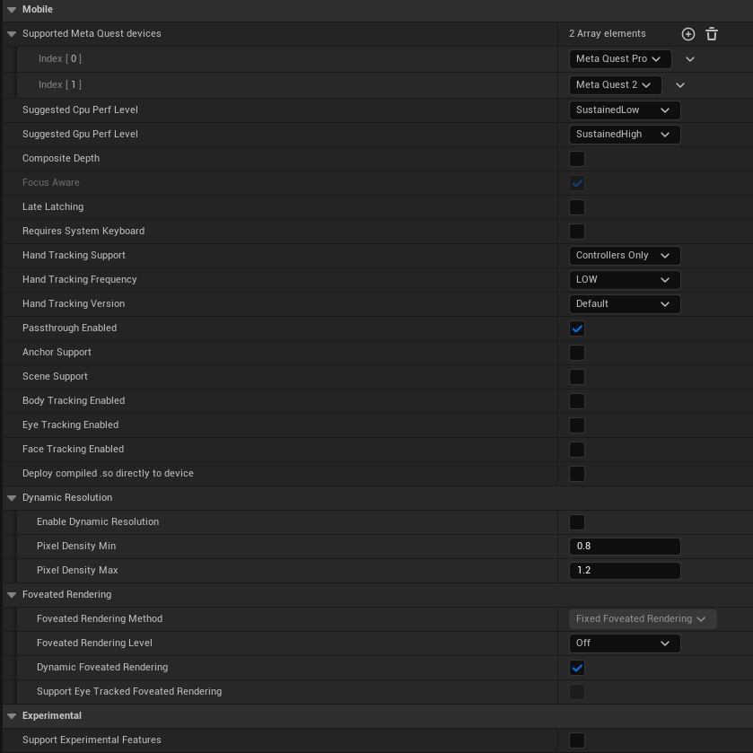

# Unreal Quest 3 Scene Sample

Welcome to the Unreal Quest 3 Scene Sample project! This repository provides a complete example of how to create a passthrough experience in Unreal Engine for the Oculus Quest 3 and introduces a unique shader that acts as a real-time occluder, enabling real-life objects to be seamlessly integrated into the virtual environment.

Map out your Space / Highlight Scene Objects / Occlude them in Real Life / Go Crazy

This Project is made on Unreal 5.2.0 OR LATEST ONE, Please use this or newer versions to run this one.


## Features

- **Passthrough Experience**: Enjoy a seamless passthrough experience on your Oculus Quest 3. Immerse yourself in a combination of the virtual and real worlds, enhancing your XR experiences.

- **Real-Time Occlusion**: The project includes a custom shader that effectively occludes real-life objects in the scene. This allows for interactions and integration of real-world objects with virtual content, creating a more immersive mixed reality environment.

- **Scene Data Integration**: Use the passthrough data to access and interact with real-world objects. For example, by pressing a button, you can highlight tables or couches in your physical room. The Quest 3's passthrough data is utilized to spawn virtual objects such as meshes or materials.

- **User Interface for Real-Time Manipulation**: A user interface (UI) pops up when you press the menu button. This UI enables you to hide/show real-life tables and make them behave like occluders, seamlessly blending your virtual and physical environment.

- **Masking Real-Life Objects into Virtual Reality**: A new feature allows you to mask real-life objects into virtual reality. This means that real-world objects can be seamlessly integrated into your VR experience, with the ability to cut them from the virtual environment, allowing you to see your VR content along with the masked reality.

## Getting Started

To get started with this project, follow these steps:

1. **Clone the Repository**:


``` bash
git clone https://github.com/Ayushanbhore/Unreal-Quest3-SceneSample.git
```

2. **Install Unreal Engine**:
Make sure you have Unreal Engine installed. If not, you can download it from [Unreal Engine](https://www.unrealengine.com/).

3. **Open the Project in Unreal Engine**:
Open Unreal Engine and load the project file located in the cloned repository.

4. **Configure Oculus Quest 3**:
Ensure that your Oculus Quest 3 is connected to your development environment, and that you've configured it for use with the Unreal Engine.

5. **Build and Run**:
Build the project and run it on your Oculus Quest 3. You should now be able to experience the passthrough and real-time occlusion features.

6. **Customize and Extend**:
Feel free to customize and extend the project to suit your specific needs. Modify the shader, add new virtual objects, or experiment with other Unreal Engine features.

## License

This project is licensed under the MIT License. See the [LICENSE](LICENSE) file for more details.

## Acknowledgments

We would like to express our gratitude to the Unreal Engine community and Oculus for their contributions and support in making this project possible.

## Support

For any questions, issues, or feedback, please create a GitHub issue or contact us at [your@email.com].

Enjoy your Unreal Quest 3 Scene Sample experience!

# Unreal-Quest3-PassthroughSample

This repository contains a sample Unreal Engine project demonstrating how to integrate and utilize the Passthrough, Depth API, and Mesh API for the latest Oculus Quest 3 device. This project serves as a reference for developers looking to create immersive Augmented Reality / Mixed Reality Experiences using Unreal Engine on the Oculus Quest 3 platform.

Table of Contents
- [Overview](#overview)
- [Getting Started](#getting-started)
  - [Prerequisites](#prerequisites)
  - [Installation](#installation)
- [Usage](#usage)
- [Contributing](#contributing)
- [License](#license)


# Overview
This sample project showcases the integration of Passthrough, Depth API, and Mesh API provided by Oculus for the Meta Quest 3 VR headset within the Unreal Engine 5.1.1 environment. It demonstrates how to access and utilize real-time camera feed (passthrough), depth information, and mesh data to create AR experiences in the Unreal Engine environment for Oculus Quest 3 and also for Oculus Quest Pro

# Getting Started
Prerequisites
Before using this sample project, make sure you have the following prerequisites installed and set up:

# Prerequisites
- Unreal Engine (version 5.1.1 or later)
- MetaXR Plugin for Unreal Engine (51.0 , 53.0 , 54.0)
- Meta Quest 3 Device or Meta Quest Pro Device
- Meta Developer Account

# Installation
1. Clone this repository to your local machine:

``` bash
git clone https://github.com/ayushanbhore/Unreal-Quest3-PassthroughSample.git
```
2. Open the project in Unreal Engine. Works Best with Unreal Engine 5.1.1 and later

3. Download the MetaXR Plugin for your Engine 

-> Preferably - 54.0 Version
``` bash
https://developer.oculus.com/downloads/package/unreal-engine-5-integration
```

4. It is recommended to place the MetaXR Plugin in the Marketplace Folder inside your Unreal Engine Directory

5. Launch Unreal Engine and Make Sure to Tick these Plugins in the Plugins Section

 -> Please Uncheck Oculus VR Plugin or it may cause issues 
 
   


7. Copy these settings in the Project Settings -> Plugins -> MetaXR -> Mobile Section of you Unreal Engine
   
  
  

# Usage
Follow these steps to run the sample project and explore the integration of Passthrough, Depth API, and Mesh API:

1. Connect your Oculus Quest 3 device to your Development machine using a Link ( Link Cable Recommended over the Air Link).

2. Build and Deploy the project to your Oculus Quest 3 device using Unreal Engine.

3. Put on your Oculus Quest 3 headset and experience the augmented reality environment created using Passthrough.

# License
This sample project is licensed under the MIT License. Feel free to modify and distribute it according to the terms of the license.


